# This project implements EmotionDesign app

> EmotionDesign is a service that will help users to control their emotions,\
> it will hold data per day with the ability to show total graph with emotions

# <a name="TableOfContents">Table of contents</a>
+ [Description](#Description)
    + [Main view](#MainView)
        + [Add entry tab](#AddEntry)
        + [Info tab](#Info)
        + [Analysis tab](#Analysis)
    + [Initial emotion selection tab](#InitialEmotion)
	+ [Common emotion selection](#CommonEmotion)
	+ [Add emotion to history](#SaveEmotion)

# <a name="Description">Description</a>

This application was created with intention to help users to control and analyze their emotions

[Back to the table of contents ⬆](#TableOfContents)

## <a name="MainView">Main view</a>

[Back to the table of contents ⬆](#TableOfContents)

### <a name="AddEntry">Add entry tab</a>

| Dark Theme | Light Theme |
| --- | --- |
|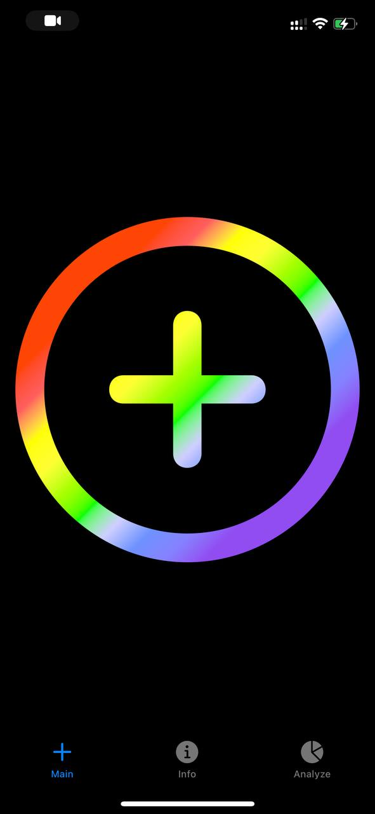|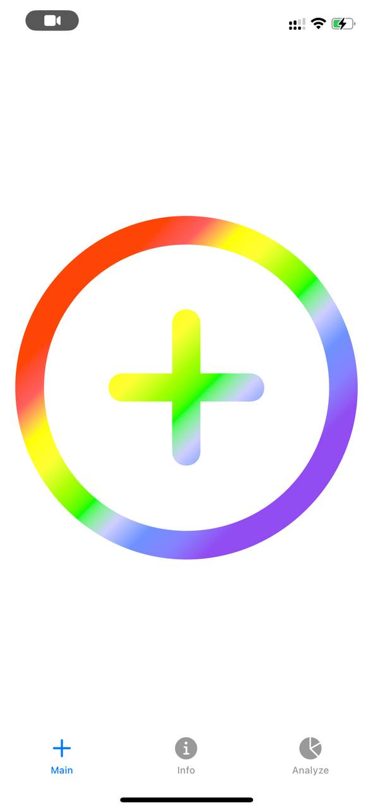|

[Back to the table of contents ⬆](#TableOfContents)

### <a name="Info">Info tab</a>

| Dark Theme | Light Theme |
| --- | --- |
|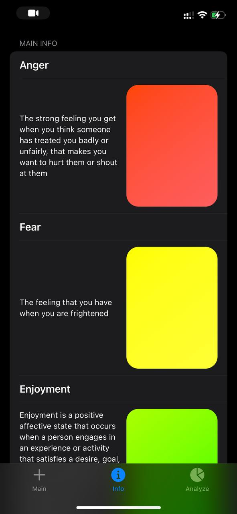|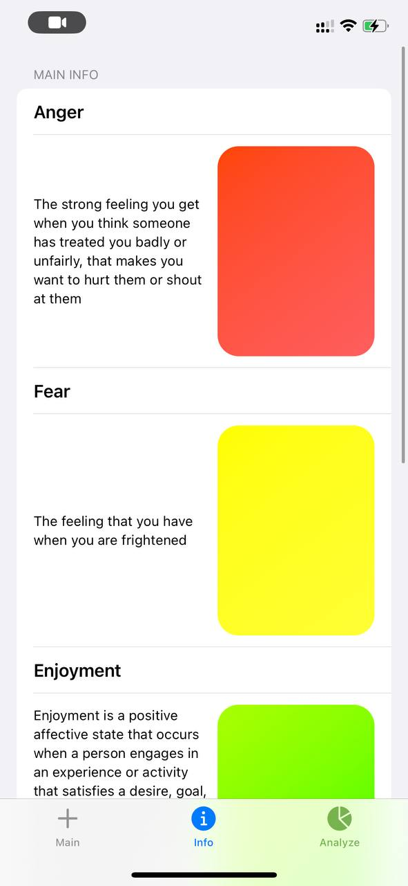|

[Back to the table of contents ⬆](#TableOfContents)

### <a name="Analysis">Analysis tab</a>

Dark Theme
| Clean View | Filled view | Clear view |
| --- | --- | --- |
|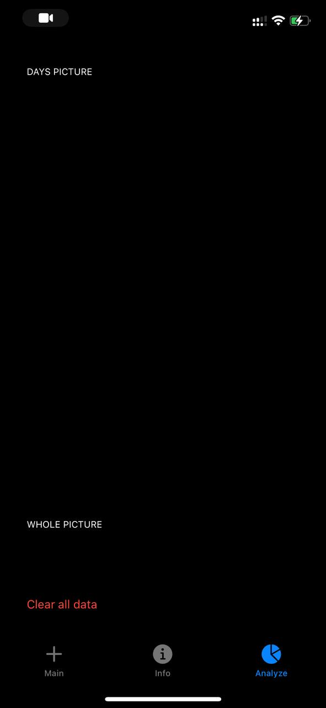|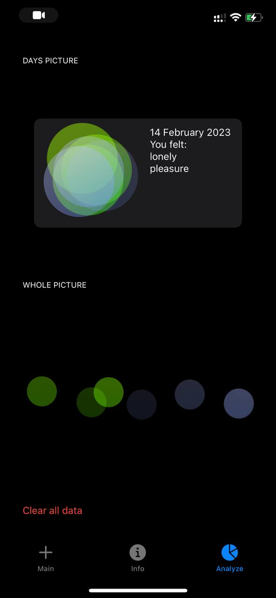|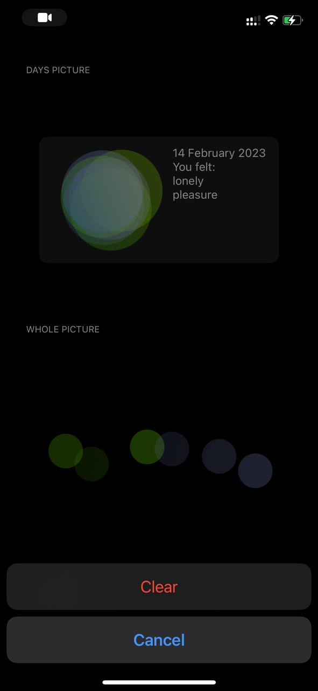|
												      
Light Theme
| Clean View | Filled view | Clear view |
| --- | --- | --- |
|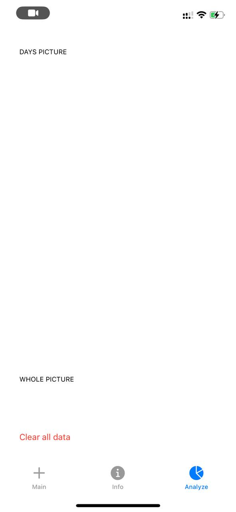||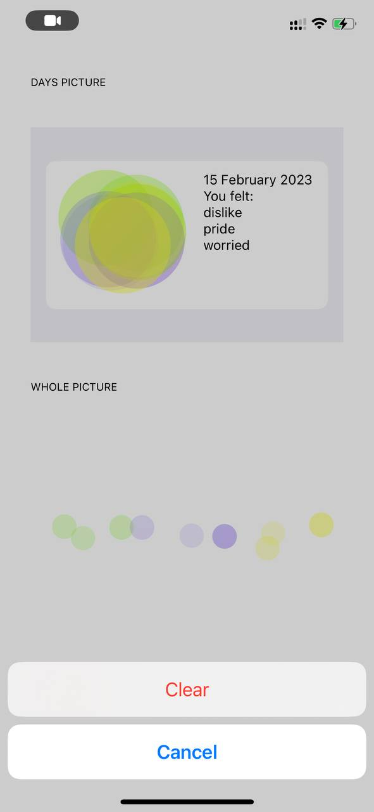|								

[Back to the table of contents ⬆](#TableOfContents)

## <a name="InitialEmotion">Initial emotion selection tab</a>

| Dark Theme | Light Theme |
| --- | --- |
|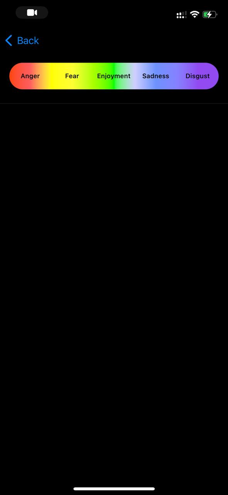|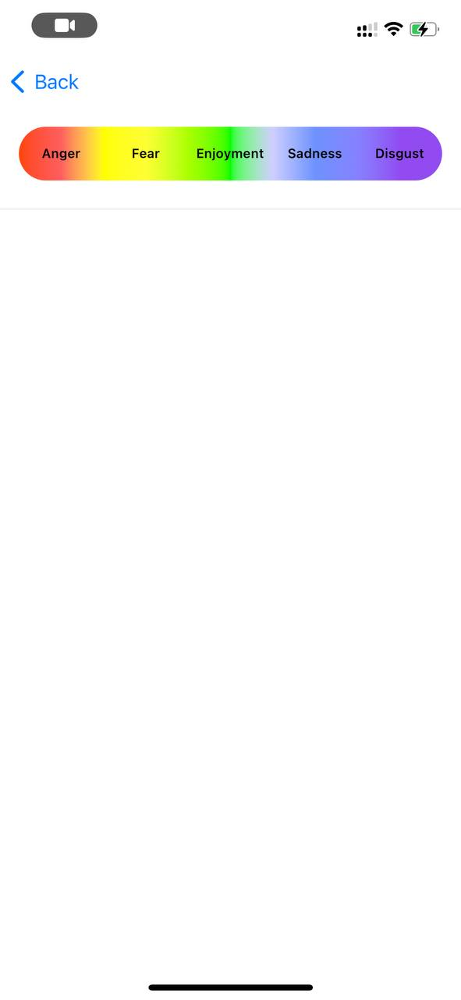|

[Back to the table of contents ⬆](#TableOfContents)

###  <a name="CommonEmotion">Common emotion selection</a>

| Dark Theme | Light Theme |
| --- | --- |
|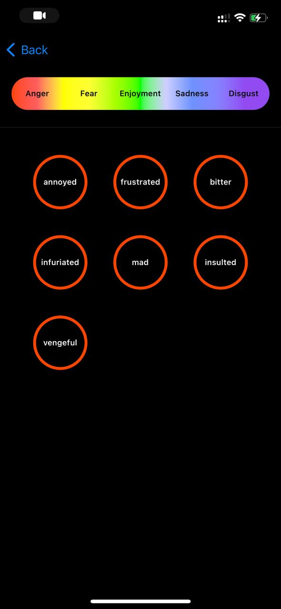|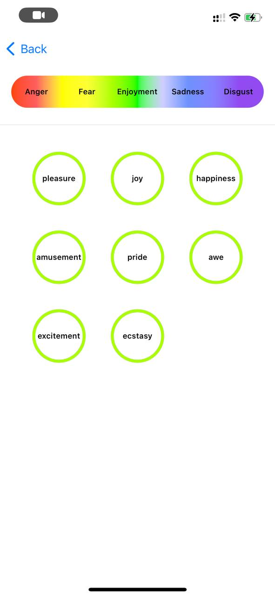|

[Back to the table of contents ⬆](#TableOfContents)

###  <a name="SaveEmotion">Add emotion to history</a>
| Dark Theme | Light Theme |
| --- | --- |
|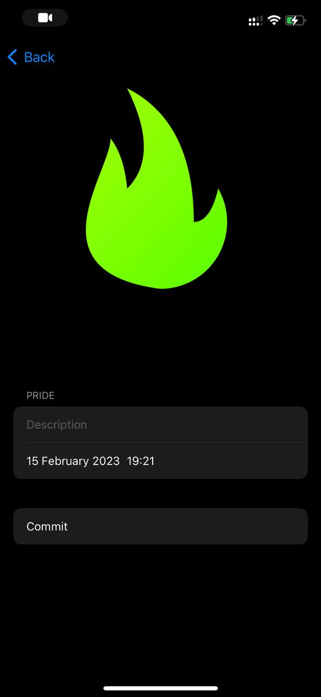|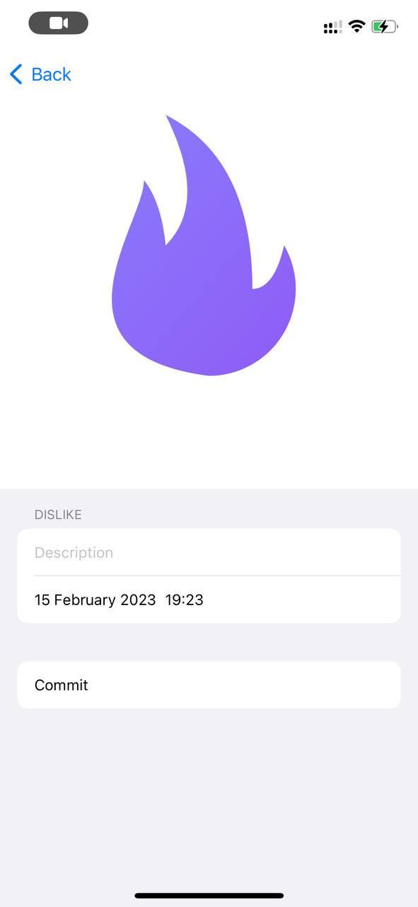|

[Back to the table of contents ⬆](#TableOfContents)
