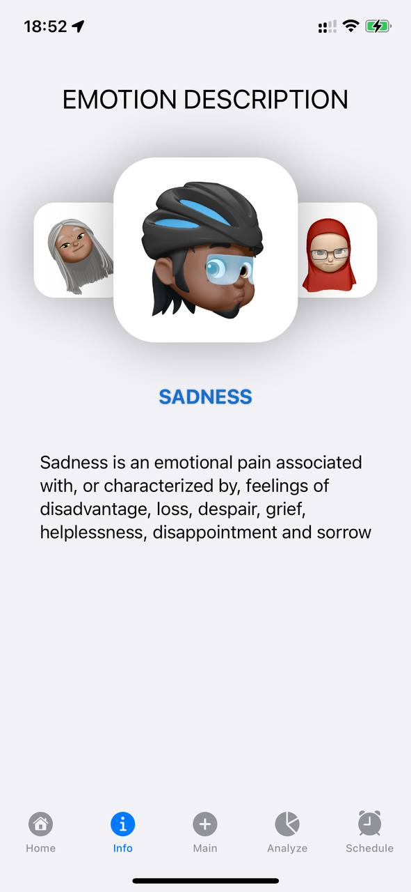

# This project implements EmotionDesign app

> EmotionDesign is an app that allows users to track their emotions daily \
> and analyse the range of their feelings over time using statistics. 

# Table of contents
+ [Description](#Description)
    + [Technology](#Technology)
    + [Main view](#MainView)
    	+ [Home tab](#HomeTab)
        + [Info tab](#InfoTab)
        + [Main Tab](#MainTab)
        	+ [Initial emotion selection tab](#InitialEmotion)
        	+ [Common emotion selection](#CommonEmotion)
        	+ [Add emotion to history](#SaveEmotion)
        + [Analysis tab](#AnalysisTab)
        + [Schedule Tab](#ScheduleTab)
+ [Special thanks](#SpecialThanks)
       

# <a name="Description">Description</a>

This application was created with intention to help users to control and analyze their emotions. \
It contains a wide range of emotions that user could choose and review an infographics in day slices \
Finally one could review how all emotions they felt are accumulated in the colorful graph. \
The less negative emotions were felt - the clearer would be the image.

[Back to the table of contents ⬆](#TableOfContents)

## <a name="Technology">Technology</a>
A brief description about the project: 
- [x] The project uses [MVVM](https://en.wikipedia.org/wiki/Model–view–viewmodel) model  
- [x] The initial data is holded in json file, thus, it is easy to add new data to the app 
- [x] Persistence of data is achieved by using [Core Data](https://developer.apple.com/documentation/coredata) 
- [x] Push up notifications were implemented locally with UserNotifications
- [x] Logging impleented with OSLog

[Back to the table of contents ⬆](#TableOfContents)

## Main view
At the main view there is a TabView with 5 tabs that one could find below. \
All tabs are interactive and would be described further in this guide.

|||

[Back to the table of contents ⬆](#TableOfContents)

### Home tab
This is the first tab that user could find in the app. That app has brief information about this application

| Dark Theme | Light Theme |
| --- | --- |
|||

[Back to the table of contents ⬆](#TableOfContents)

### Info tab
This tab provides a brief description of initial emotions that you may face. 

| Dark Theme | Light Theme |
| --- | --- |
|||

[Back to the table of contents ⬆](#TableOfContents)

### Main tab

[Initial emotion selection tab](#InitialEmotion), there they could choose one of the several initial emotions.

#### Initial emotion selection tab
Initial Emotion tab is an auxiliarytab, that is performed in scroll view with initial emotions on it. \
Users could chose the general emotion they felt. After choosen one of the emotions, \
the relevant common emotions are being listed below in the collection

| Dark Theme | Light Theme |
| --- | --- |
|||

[Back to the table of contents ⬆](#TableOfContents)

####  Common emotion selection
This view is fully interactive. And user could chose one of the emotions they've felt. \
To confirm the choice the button belove should be pressed, thus, the user will be redirected to the additional view.

| Dark Theme | Light Theme |
| --- | --- |
|||
|||

[Back to the table of contents ⬆](#TableOfContents)

####  Add emotion to history
At this view users could comment their emotion choice or leave it empty as it is. \
To add chosen emotions to the history users should press the 'SAVE' button.

| Dark Theme | Light Theme |
| --- | --- |
|||

[Back to the table of contents ⬆](#TableOfContents)

### Analysis tab
At the Analysys tab there are two sections: the first section provides information about emotions user felt
in charts grouped by emotions. User could look at the whole period or review only last 7 days.
The second section shows the list of emotions displayed in the chart above.
Users could review all this data and clear all the data.

Dark Theme
| Clean View | Filled view | Clear view |
| --- | --- | --- |
||||
												      
Light Theme
| Clean View | Filled view | Clear view |
| --- | --- | --- |
||||								

[Back to the table of contents ⬆](#TableOfContents)

### Schedule tab
At the Schedule tab user could add notifiactions to make alerts on required schedule in order to notify the user \
that they could fix their emotions. At the firrt appearence of this view the permissions would be checked, \
and if there are required - directly requested from the user

Dark Theme
| Grants requested |  Clean View | Add notification | Choose period | Filled view |
| --- | --- | --- | --- | --- |
||||	||
												      
Light Theme
| Grants requested |  Clean View | Add notification | Choose period | Filled view |
| --- | --- | --- | --- | --- |
||||	||	

[Back to the table of contents ⬆](#TableOfContents)

# Special thanks
Special thanks to Rodion Gilmanov who prepared a concept for this application.  

| Main View |  Info View | Analytics View  | Notification View |
| --- | --- | --- | --- |
|  |  |  |  |

[Back to the table of contents ⬆](#TableOfContents)
